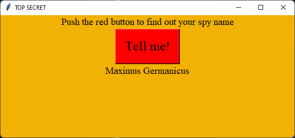

# Python GUI Spy Name Chooser

## Description:

This project is a simple guide to getting started on creating a GUI application on Python. This project makes use of the [guizero python library](https://lawsie.github.io/guizero/about/).

## How to Run:

1. Fork the Repository
2. Clone the Repository
3. Run the Code in your IDE

## Source Code:

```python
# Imports -------------------------------
from guizero import App, Text, PushButton
from random import choice

# Functions -----------------------------
def choose_name():
    first_names = ["Caius", "Tiberius", "Constantine", "Maximus", "Augustus", "Titus", "Marcus"]
    last_names = ["Quintillius", "Domitianus ", "Octavianus", "Germanicus", "Flavius", "Aurelius", "Caesar"]
    spy_name = choice(first_names) + " " + choice(last_names)
    name.value = spy_name

# App -----------------------------------
app = App("TOP SECRET")
app.bg = "#F1B105"
app.width = 600
app. height = 250

# Widgets -------------------------------
title = Text(app, "Push the red button to find out your spy name", font="Times New Roman")
title.text_size = 15

button = PushButton(app, choose_name, text="Tell me!")
button.bg = "red"
button.text_size = 20
button.font = "Times New Roman"

name = Text(app, text="", font="Times New Roman")
name.text_size = 15

# Display -------------------------------
app.display()
```

## GUI Result:



## Online Resources:
* [Random](https://docs.python.org/3/library/random.html#module-random)
* [Guizero](https://lawsie.github.io/guizero/about/)
* [Guizero - App](https://lawsie.github.io/guizero/app/)
* [Guizero - TitleBox](https://lawsie.github.io/guizero/titlebox/)
* [Guizero - Layouts](https://lawsie.github.io/guizero/layout/)
* [Guizero - PushButton](https://lawsie.github.io/guizero/pushbutton/)
* [HTML Color Codes](https://htmlcolorcodes.com/)